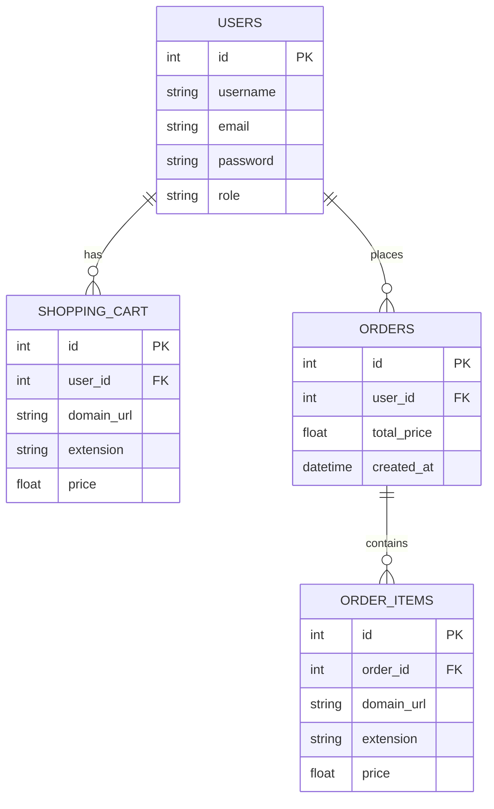

```mermaid
    erDiagram
        USERS {
            int id PK
            string username
            string email
            string password
            string role
        }

        SHOPPING_CART {
            int id PK
            int user_id FK
            string domain_url
            string extension
            float price
        }

        ORDERS {
            int id PK
            int user_id FK
            float total_price
            datetime created_at
        }

        ORDER_ITEMS {
            int id PK
            int order_id FK
            string domain_url
            string extension
            float price
        }

        USERS ||--o{ SHOPPING_CART : "has"
        USERS ||--o{ ORDERS : "places"
        ORDERS ||--o{ ORDER_ITEMS : "contains"

```